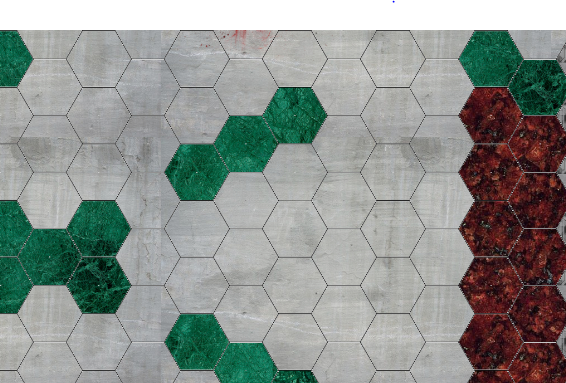
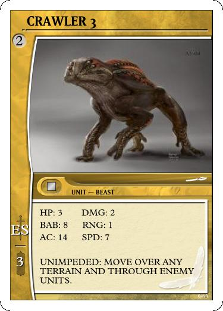

___
A Unit can move in any direction and a number of spaces equally to its speed stat. (SPD)

* They cannot move through the green barriers of the map.

* They cannot move through Enemy Units.

The Following is an example of A Unit with SPD 4. Notice on the map, the highlighted areas it can move to.

A Unit with the static ability UNIMPEDED can move through Enemy Units and over barriers, but my not stop on these spaces.

