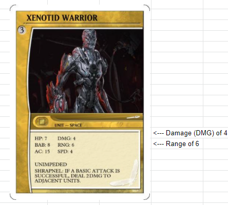
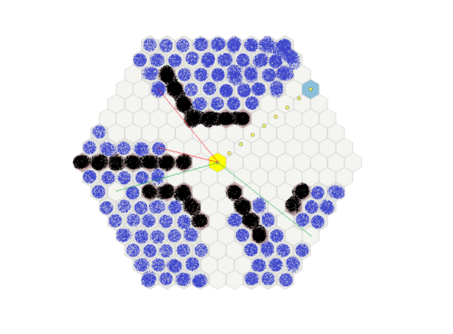

___			
Units have a range (RNG) Shown on the Unit Card here				

				
When A Unit wants to engage combat with another				
Unit within its RNG it may chose between a Basic Attack				
Or A Special Attack if the Unit has an 				
abitlity or an Equipmenct Card that gives it a Special				
Attack. 				

 
The attacking Unit rolls the 2D6				
Then adds Its BAB Stat				
				
 

The Defending Unit blocks with its AC Stat				

    IF the Attacking units 2D6 + BAB				
    is HIGHER then the Defending Units AC:			
                    
    DMG is dealt.
 

    IF the Attacking units 2D6 + BAB 				
    is LOWER then the Defending Units AC:		
                    
    The Attack is Blocked. No DMG is dealt.

 

    IF the Attacking Units 2D6 + BAB				
    is TIED with the Defending Units AC:			
                    
    The Attack is Blocked. No DMG is dealt. 				

Ranged Attacks
A ranged attack is any attack involving an Enemy Unit that isn't adjacent/next to the attacking Unit.

* Ranged Attacks may be made through friendly Units, but not Enemy Units.			
				
Line of site comes into play with Ranged Attacks. 				
				
When it comes to line of sight, sometimes you have to use your best judgment.

The image above shows the avalible targets a unit has if its standing in the YELLOW hex on the map.

The blackened out areas are "walls" or Enemy units and you cannot target units behind them.

The BLUE highlited hex on the map are untargetable units.		

The WHITE Hex are targetable hexes by drawing a straight line From the CENTER of the YELLOW hex to the CENTER of the targeted hex.

In this image, lines are drawn from the center of one hex, to the center of another.	

If the line comes in contact with a Wall or an enemy unit before the target hex, the unit cannont be targeted. 	

If the line doesnt come in contact with a wall or an enemy unit before the target hex, the target is legal.