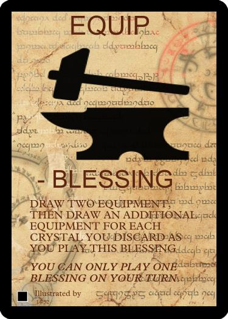
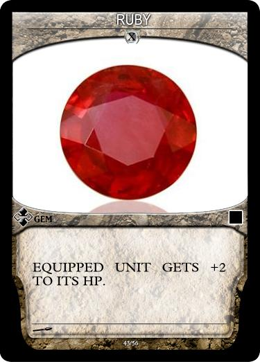
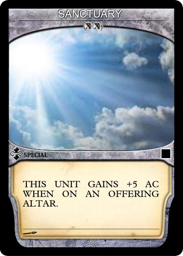

___

Equipment is primarily attached by the Fate Card EQUIP

The Equip Fate Card allows you to draw two+ cards from the Equipment Deck and immediately equip them to any Unit you own.

A Unit may only be equipped with an equipment card if they have the necessary Equipment Slots (ES), you may discard equipment already equipped to a unit to fit new Equipment onto the target Unit.

A Unit may have more than one equipment attached to it as long as the total cost of all the equipment does not exceed the Units Equipment Slots.

There are 3 different types of Equipment:

#### Gem

#### Special

#### Special Action

