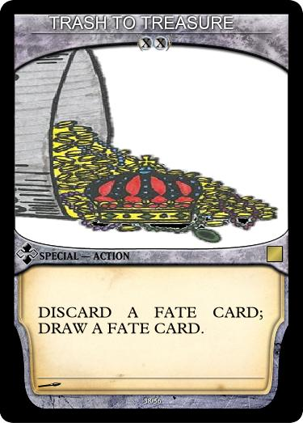
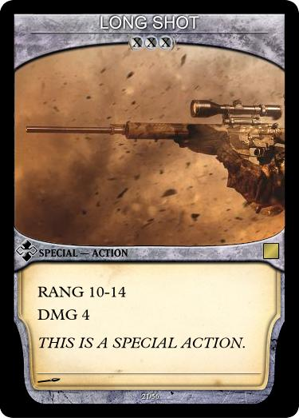

___

Equipment is primarily attached by the Fate Card EQUIP

The Equip Fate Card allows you to draw two+ cards from the Equipment Deck and immediately equip them to any Unit you own.

A Unit may only be equipped with an equipment card if they have the necessary Equipment Slots (ES), you may discard equipment already equipped to a unit to fit new Equipment onto the target Unit.

A Unit may have more than one equipment attached to it as long as the total cost of all the equipment does not exceed the Units Equipment Slots.

There are 3 different types of Equipment:

> All three different types of equipment have the Number of slots they take up under the Name.

#### Gem

The RUBY Equipment gem has an equipment cost of 1.

#### Special

The SANCTUARY Equipment specal gives a static stat boost and has an equipment cost of 2.

#### Special Action

The TRASH TO TREASURE Equipment specal gives an optional action that replaces a units movement action for a turn, and has an equipment cost of 2.

 
___

#### Special Action Equipment

Some equipment provides a unit with a Special Action.

LONG SHOT provides an action that deals 4 DMG at a RNG of 10-14.

This Specail Action Equipment Card provides stats for using this action, notice the RNG and DMG, some equipment also have specail static abilities as well. 

This Actions RNG is at least 10 spaces away and at most 14. You wont be able to use this action on an enemy Unit thats 7 spaces away. If a hit is Successful, the Enemy Unit takes 4 DMG.