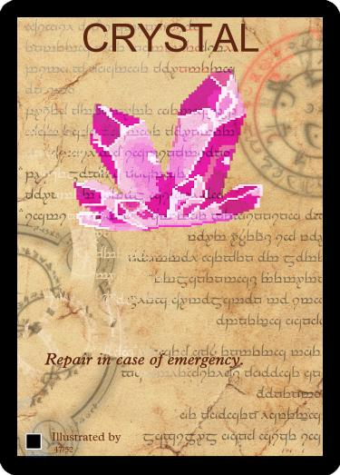
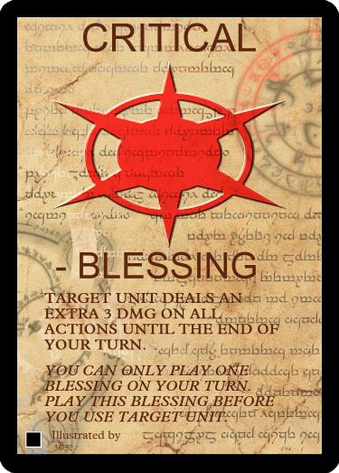
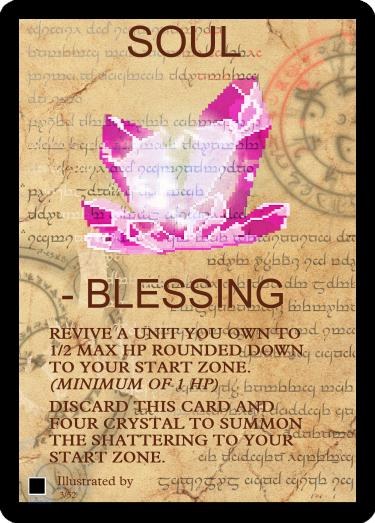
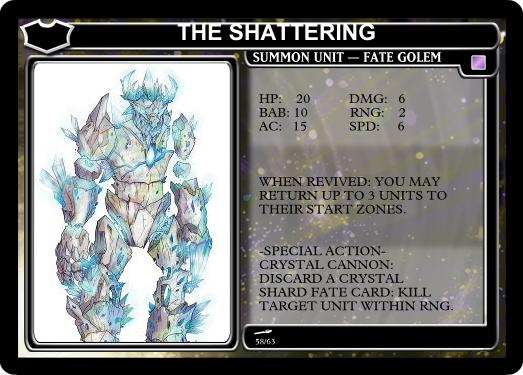

There are two main types of Fate Cards, You my only play a Blessing Once per turn.

#### Crystals

#### Blessings

You may only Use one Blessing a turn.

The CRITICAL Fate Card can only be used on a Unit before you use any Actions or Movement for that Unit.

Blessings allow the player to perform a powerful action each turn, while Crystals are resources for Blessings Units and Equipment to take advantage of.

> The most powerful of all the Fate Cards is the SOUL Fate Card.

The SOUL Fate Card has two options on how to play it. It can either be used to revive a fallen unit, or, if you have four CRYSTAL Fate cards, can be used to summon The Shattering to your start zone to aid you in battle. (Summoning The Shattering with the SOUL Fate Card counts as using a Blessing the for that turn. You may only use one Blessing a turn.)

The Shatting is a strong Unit and capable of ending the game quickly. But waiting to collect all those CRYSTAL Fate Cards could make you fall behind the competition.

