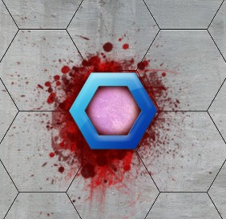

___
Players Take Turns Moving around the board Fighting Enemy Units And/or Sacraficing life to Offering Fountains
The winner is the last player with Units Left on the Board or The player to Sacrafice 4 HP into all 4 Offering Fountains.

 

### Who Goes first
Decide who plays first by rolling the 2D6 (2 six sided dice) provided in the box.

High Roll wins.

Turns are then played out in a clockwise fashion.

 

### Draw Fate Cards

Players draw 5 Fate Cards. At the start of the game. (Max Hand Size 5)

Each Player Draws An Aditional Fate Card at the Beginning of their turn.

    At the end of your turn, you must discard Fate Cards to Max Hand Size.

 

### A Players Turn

Start by Drawing a Fate Card.

 

The Active Player may use their Units in any order.

That Player Must Complete One Units Turn at a time.

A Units Turn has Two Steps Which can be Performed in any order. 							
							
* #### Movement							
* #### Action
* #### Free Action					
							
 

#### Movement 

Movement Of a Unit is Displayed by the (symbol/SPD) Stat.

If A Units Movement is 10 it may move up to ten spaces on the board.

* If it only moves four, then it is done with its movement for that Units Turn. It can not move the Remaining Six.
* You may Move through your own Units, but not Enemy Units. 						

 

#### Action							
A unit my Perform One of Four Different Types of Actions A turn.							
* It may make a Basic Attack against an Enemy Unit thats in range by rolling a 2D6 and Adding its BAB against the Enemy Units AC. 
* It may use a Special Attack Ability either on the card or one given from an Equipment

     IF an Attack roll is 14, and the enemy units AC is 14. The Attack Misses. You must Exceed the enemies AC to hit. 

* It may Sacrafice 4 HP to an Offering Fountain. 

    Unit must be on the Offering Fountain to Sacrafice 4 HP to it. 
	
     

#### Free Action 
Free actions are Free and you may still use a Basick Attack, Special Attack, or Sacrafice.						

### Using Fate Cards

You may only Use on Fate Card A turn. There are two types of Fate Cards

* #### Crystals

* #### Blessings

 

#### Crystals

Crystals are resources for other Fate Cards and some Unit cards to use, they don't do anything but are used for additional effects when discarded.
 

#### Blessings

You can Use a Blessing card anytime during your turn. Place the Fate card in the Discard pile after use.
 

 