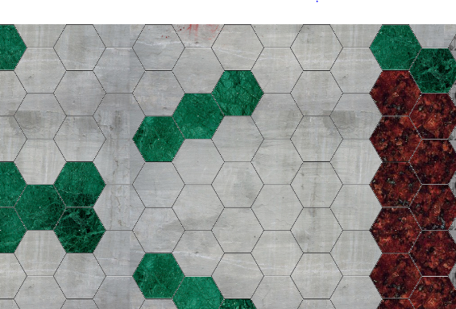
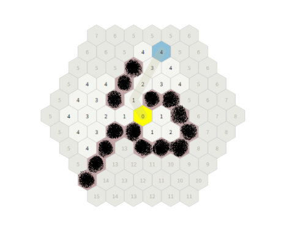
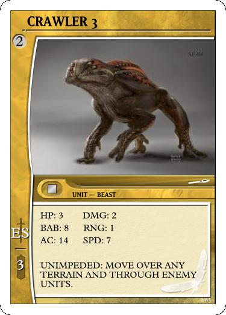

___
A Unit can move in any direction
* They cannot move through the green barriers of the map.

* They cannot move through Enemy Units.

The Following is an Example of A Unit with SPD 4. Notice on the map, the highlighted areas it can move to.

A Unit with the static ability UNIMPEDED Can move through Enemy Units and Over barriers, but my not stop on these spaces.

 