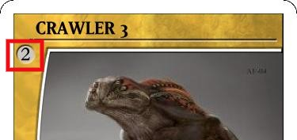

___

### Step 1
Each Player Picks 1 of the main factions.

1. Arachin
2. Lore
3. Mecha
4. Space
5. Unrooted

* Each Player is also given a CRAWLER unit, and a Hound unit.
 

### Step 2

Each Player then creates a 10 Point Army to play with out of the factions units they have selected. 

Point value of a card can be found in the upper left hand corner of the card.

 

### Step 3

Each Player picks a base color and puts thier units on the coresponding color start position.
 

### Step 4

Shuffle the Fate deck, and equipment deck. Place them to the side.
 
 

### The board is ready!
___
 

 