# TacticAS

    T.A.S. is a tabeltop minitaures game, Where 2-4 players battle as Gods with powerful Units from across time and space to decide who the true victor is. 

    Do you choose to make your Units Sacrafice themselves for your cause? Or are you the type of God to cross weapons on the battle field for true glory.  

    Whatever kind of God you choose to be, do it quickly, for The Shattering will seal your Fate.

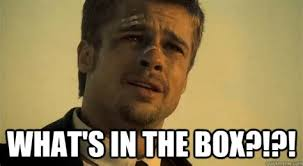


1. 62 Unit Cards
2. 56 Equipment Cards
3. 52 Fate Cards
4. 42 Dice
5. 1 Map
6. 40 Figure Bases

___
<br>

## Quick Play Setup

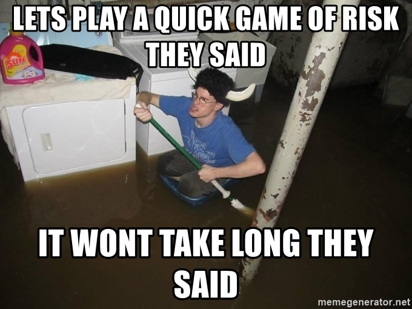


### Step 1
Each Player Picks 1 of the main factions.

1. Arachin
2. Lore
3. Mecha
4. Space
5. Unrooted

* Each Player is also given a CRAWLER unit, and a Hound unit.
<br>

### Step 2

Each Player then creates a 10 Point Army to play with out of the factions units they have selected. 

Point value of a card can be found in the upper left hand corner of the card.

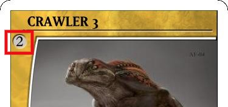

<br>

### Step 3

Each Player picks a base color and puts thier units on the coresponding color start position.
<br>

### Step 4

Shuffle the Fate deck, and equipment deck. Place them to the side.
<br>
<br>

### The board is ready!
___
<br>

<br>

## How to play

Players Take Turns Moving around the board Fighting Enemy Units And/or Sacraficing life to Offering Fountains
The winner is the last player with Units Left on the Board or The player to Sacrafice 4 HP into all 4 Offering Fountains.

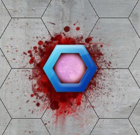

<br>

### Who Goes first
Decide who plays first by rolling the 2D6 (2 six sided dice) provided in the box.

High Roll wins.

Turns are then played out in a clockwise fashion.

<br>

### Draw Fate Cards

Players draw 5 Fate Cards. At the start of the game. (Max Hand Size 5)

Each Player Draws An Aditional Fate Card at the Beginning of their turn.

    At the end of your turn, you must discard Fate Cards to Max Hand Size.

<br>

### A Players Turn

Start by Drawing a Fate Card.

<br>

The Active Player may use their Units in any order.

That Player Must Complete One Units Turn at a time.

A Units Turn has Two Steps Which can be Performed in any order. 							
							
* #### Movement							
* #### Action
* #### Free Action					
							
<br>

#### Movement 

Movement Of a Unit is Displayed by the (symbol/SPD) Stat.

If A Units Movement is 10 it may move up to ten spaces on the board.

* If it only moves four, then it is done with its movement for that Units Turn. It can not move the Remaining Six.
* You may Move through your own Units, but not Enemy Units. 						


<br>

#### Action							
A unit my Perform One of Four Different Types of Actions A turn.							
* It may make a Basic Attack against an Enemy Unit thats in range by rolling a 2D6 and Adding its BAB against the Enemy Units AC. 
* It may use a Special Attack Ability either on the card or one given from an Equipment

     IF an Attack roll is 14, and the enemy units AC is 14. The Attack Misses. You must Exceed the enemies AC to hit. 

* It may Sacrafice 4 HP to an Offering Fountain.		
	
<br>    

#### Free Action 
Free actions are Free and you may still use a Basick Attack, Special Attack, or Sacrafice.						


### Using Fate Cards

You may only Use on Fate Card A turn. There are two types of Fate Cards

* #### Crystals

* #### Blessings

<br>

#### Crystals

Crystals are resources for other Fate Cards and some Unit cards to use, they don't do anything but are used for additional effects when discarded.
<br>

#### Blessings

You can Use a Blessing card anytime during your turn. Place the Fate card in the Discard pile after use.
<br>


<br>

### Units

<br>

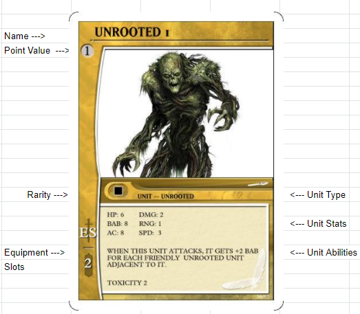
<br>

A Unit has many parts,			
			
1. Name: The name of this Unit is "Unrooted" the number next to its name "1" is to identify it to its relative Unit Token.

2. Point Value: The Point Value of this card is "1" you will use this number to build your Team. A standard Game of T.A.S. has 10pt Teams.

3. Rarity: Rarity of a card only applies when you are Making packs to Draft, "Unrooted" units are   of Common Rarity.			
4. Equipment Slots: This Unit can Carry up to 2pts of Equipment Cards.			
5. Unit Type: A Units Type can be seen here, some units can be multiple different Types. The "Unrooted" unit has the Type "Unrooted."			
6. Unit Stats: Here you will find the Units HP, BAB, AC, DMG, RNG, and SPD Stats. 			
7. Unit Abilities:  Here you will find Special Actions or Special Movements the can be preformed by the unit. The "Unrooted" Unit has two abilites. 			
    * The first Ability is a BAB Ability and affects the cards BAB when Attacking. 
    * The Second ability is a DMG ability know as Toxicity 2, this ability accures when DMG is Dealt. 			

<br>
<br>

### Combat		
				
Units Have a Range Shown on the Unit Card Here				


				
When A Unit wants to engage Combat with another				
Unit within its Range it may chose between a Basic Attack				
Or A Special Attack if the Unit has an 				
Abitlity or An Equipmenct Card that gives it a Special				
Attack. 				

<br>
The attacking Unit Rolls The 2D6				
Then Adds Its BAB Stat				
				
The Defending Unit blocks with its AC Stat				


```
IF the Attacking units 2D6 + BAB				
is HIGHER then the Defending Units AC Stat				
				
DMG is dealt. 				
```

```
IF the Attacking units 2D6 + BAB 				
is LOWER then the Defending Units DEF Stat.				
				
The Attack is Blocked. No DMG is dealt. 				
```

```
IF the Attacking Units 2D6 + BAB				
is TIED with the Defending Units DEF Stat. 				
				
The Attack is Blocked. No DMG is dealt. 				
```


Ranged Attacks				
* Ranged Attacks may be made Through Friendly Units			
* But not Enemy Units			
				
Line of site Comes into play with Ranged Attacks. 				
				
When it comes to line of Sight, sometimes you have to use your best judgment.

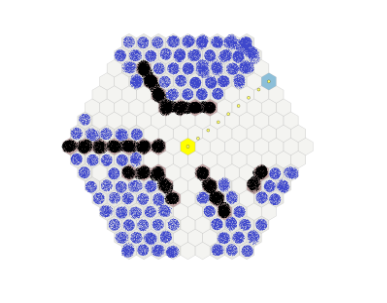

The image above shows the avalible targets a unit has if its standing in the Yellow hex on the map.

The blackened out areas are "walls" or Enemy units and you can not target units behind them.

The Blue highlited Hex on the map are untargetable units.		

The white Hex are targetable Hexes By drawing a straight line From the CENTER of the yellow Hex to the CENTER of the Targeted Hex.

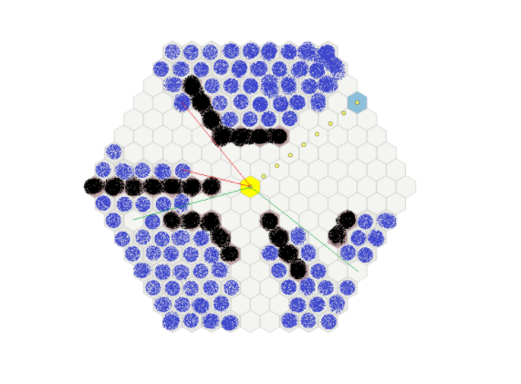

In this image, lines are drawn from the center of one Hex, to the center of another.	

If the line comes in contact with a Wall or an enemy unit before the Target Hex, the unit cannont be Targeted. 	

If the line doesnt come in contact with a wall or an enemy unit before the target Hex, the target is legal.
<br>
<br>

### Movement

A Unit can move in any direction
* They cannot move through the green barriers of the map.

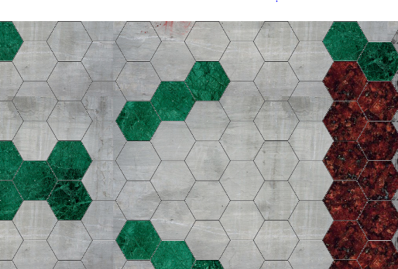

* They cannot move through Enemy Units.

The Following is an Example of A Unit with SPD 4. Notice on the map, the highlighted areas it can move to.

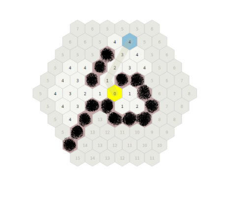


A Unit with the static ability UNIMPEDED Can move through Enemy Units and Over barriers, but my not stop on these spaces.

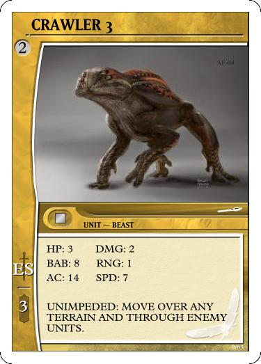

<br>

### Equipment

Equipment is primarily attached by the Fate Card EQUIP

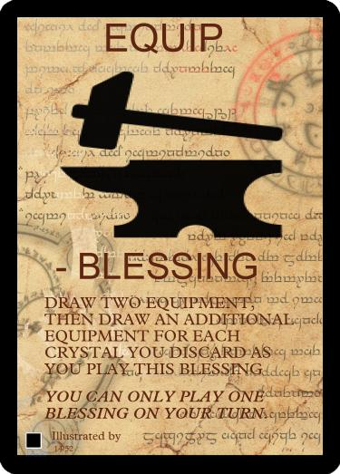


The Equip Fate Card allows you to draw two+ cards from the Equipment Deck and immediately equip them to Any Unit you own.

A Unit may only be Equipped with an equipment card if they have the necessary Equipment Slots (ES).


