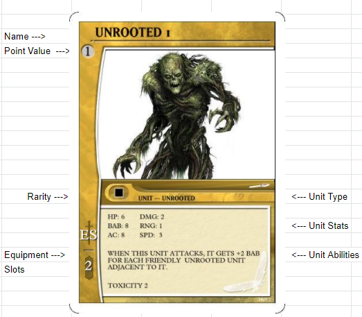

___
 

 

A Unit has many parts,			
			
1. Name: The name of this Unit is "Unrooted" the number next to its name "1" is to identify it to its relative Unit Token.

2. Point Value: The Point Value of this card is "1" you will use this number to build your Team. A standard Game of T.A.S. has 10pt Teams.

3. Rarity: Rarity of a card only applies when you are Making packs to Draft, "Unrooted" units are   of Common Rarity.			
4. Equipment Slots: This Unit can Carry up to 2pts of Equipment Cards.			
5. Unit Type: A Units Type can be seen here, some units can be multiple different Types. The "Unrooted" unit has the Type "Unrooted."			
6. Unit Stats: Here you will find the Units HP, BAB, AC, DMG, RNG, and SPD Stats. 			
7. Unit Abilities:  Here you will find Special Actions or Special Movements the can be preformed by the unit. The "Unrooted" Unit has two abilites. 			
    * The first Ability is a BAB Ability and affects the cards BAB when Attacking. 
    * The Second ability is a DMG ability know as Toxicity 2, this ability accures when DMG is Dealt. 			

 
 